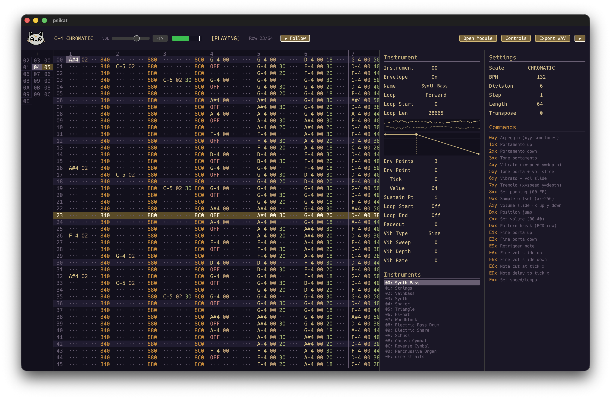

# TRAKATUI

A music tracker for the terminal, built with Rust.

## 🚧 WORK IN PROGRESS

### TODO

- [x] Pattern editor
- [x] Built-in synthesizer
- [x] Real-time playback
- [x] WAV export (44.1kHz, 16-bit)
- [x] Settings panel
- [x] Piano-roll keyboard
- [ ] Allow more channels
- [ ] Stable audio playback
- [ ] Instrument editing
- [ ] Effects channels
- [ ] Patterns
- [ ] Keybinding settings
- [ ] Save/load from file
- [ ] Sampler channel

## License

MIT
